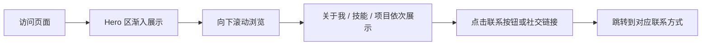

## 1. 产品概述

一个精美的个人简介单页网站，用于展示个人信息、技能、项目作品和联系方式，可分享给他人访问。

- 主要目的：打造个人品牌，展示专业能力，便于他人快速了解和联系
- 目标用户：招聘方、合作伙伴、朋友等任何想了解你的人

## 2. 核心功能

### 2.1 功能模块

1. **首页 Hero 区**：头像、姓名、职位标语、社交链接、CTA 按钮
2. **关于我**：个人简介、经历亮点
3. **技能专长**：技能标签或进度条展示
4. **项目作品**：精选项目卡片展示
5. **联系方式**：邮箱、社交媒体、在线状态

### 2.2 页面详情

| 页面名称 | 模块名称 | 功能描述 |
|-----------|-------------|---------------------|
| 首页 | Hero 区 | 大字体姓名展示、动态打字效果、渐入动画、头像悬浮效果 |
| 首页 | 关于我 | 个人简介段落、关键数据统计（工作年限、项目数等） |
| 首页 | 技能专长 | 技能分类标签、悬停高亮效果 |
| 首页 | 项目作品 | 项目卡片网格、卡片悬停动效、项目链接 |
| 首页 | 联系方式 | 联系按钮、社交图标、页脚信息 |

## 3. 核心流程

## 4. 用户界面设计

### 4.1 设计风格

- **主色调**：深墨色背景（#0a0a0f），搭配暖金色（#f5c86d）作为强调色
- **辅助色**：柔和的灰紫色调用于次要元素
- **按钮风格**：圆润胶囊形按钮，悬停时有光泽流动效果
- **字体**：标题使用 'Playfair Display' 衬线字体，正文使用 'Inter' 无衬线字体
- **布局风格**：单列纵向滚动，大留白，错落有致的排版
- **装饰元素**：微妙的噪点纹理、渐变光晕、几何装饰线条

### 4.2 页面设计概述

| 页面名称 | 模块名称 | UI 元素 |
|-----------|-------------|-------------|
| 首页 | Hero 区 | 居中布局、大标题渐入动画、头像圆形边框发光、打字机效果标语 |
| 首页 | 关于我 | 左文右数据的不对称布局、统计数字动画计数 |
| 首页 | 技能专长 | 标签云形式、悬停放大发光效果 |
| 首页 | 项目作品 | 卡片网格、悬停上移+阴影加深、图片覆盖层 |
| 首页 | 联系方式 | 居中 CTA 按钮、社交图标排列、极简页脚 |

### 4.3 响应式

- 桌面端优先设计，移动端自适应
- 移动端单列布局，字体大小适配
- 触摸设备优化点击区域

