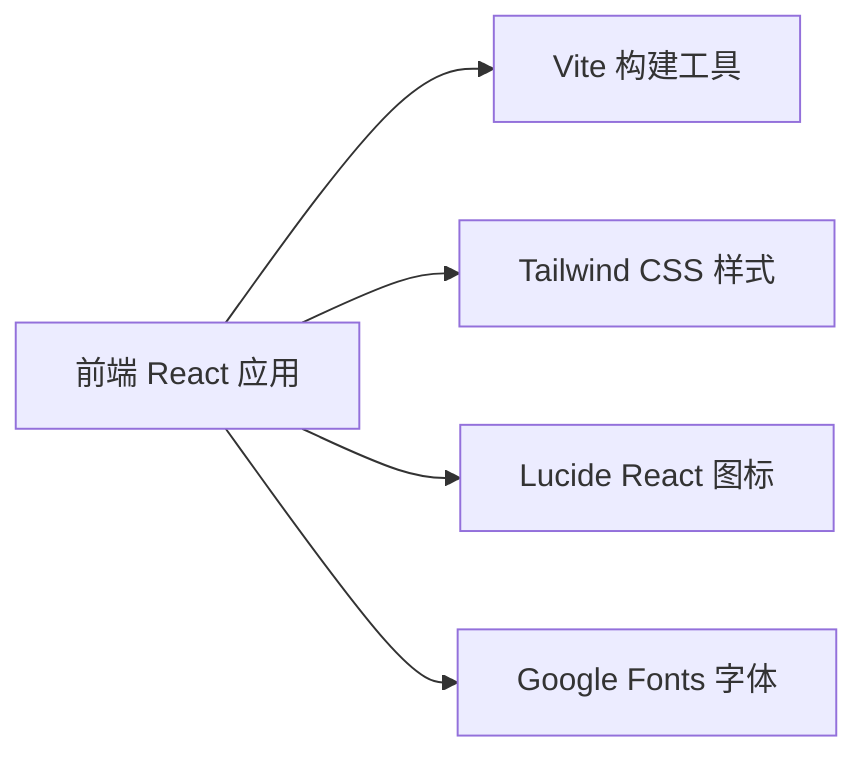

## 1. 架构设计



## 2. 技术描述

- **前端**：React@18 + TypeScript + Tailwind CSS@3 + Vite
- **初始化工具**：vite-init
- **后端**：无（纯前端静态页面）
- **数据库**：无（数据硬编码在组件中作为 demo）
- **部署**：静态页面部署，可直接分享访问

## 3. 路由定义

| 路由 | 用途 |
|-------|---------|
| / | 首页 - 个人简介单页应用 |

## 4. 数据模型

### 4.1 个人信息数据

```typescript
interface PersonalInfo {
  name: string;
  title: string;
  tagline: string[];
  avatar: string;
  bio: string;
  stats: { label: string; value: number }[];
}

interface Skill {
  name: string;
  category: string;
}

interface Project {
  title: string;
  description: string;
  image: string;
  tags: string[];
  link: string;
}

interface Contact {
  email: string;
  social: { platform: string; url: string; icon: string }[];
}
```

## 5. 项目结构

```
src/
  ├── components/
  │   ├── Hero.tsx          # 首屏 Hero 区域
  │   ├── About.tsx         # 关于我模块
  │   ├── Skills.tsx        # 技能展示
  │   ├── Projects.tsx      # 项目作品
  │   ├── Contact.tsx       # 联系方式
  │   └── Footer.tsx        # 页脚
  ├── data/
  │   └── profile.ts        # 个人信息数据
  ├── App.tsx               # 主应用组件
  ├── main.tsx              # 入口文件
  └── index.css             # 全局样式
```

